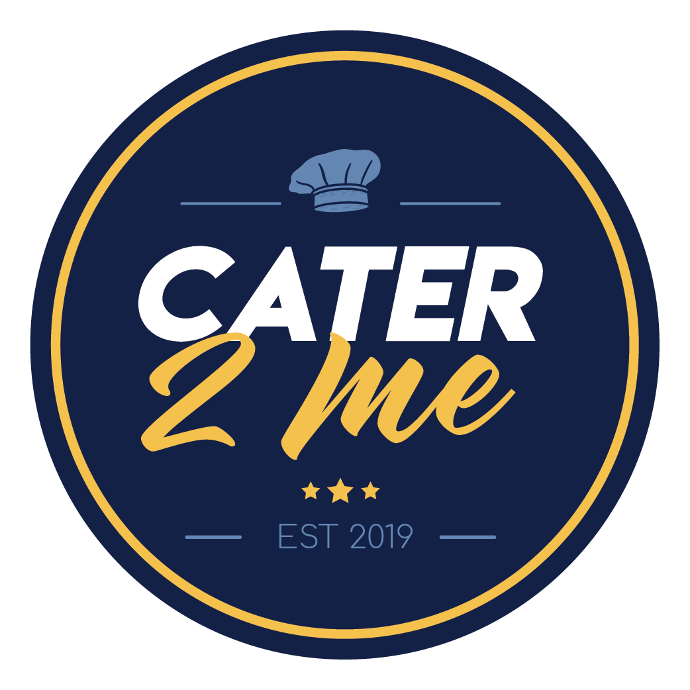

 

<h2 style="text-align: center;">The Problem</h2>

Cater2Me is an app that can span the entirety of the online consumer environment. Our target vertical for launch will be the catering industry. Catering is a niche industry that most consumers don't have experience with until they need it. This creates a market that is hard to approach and often leads to the consumer taking the first offer shot their way. Vendors, whether big or small face the issue of filling as many time slots as possible, doing so consistently, and showcasing what they offer compared to their competitors. However, my madeup research shows that consumers typically only get 1 or 2 quotes before moving forward, so the small companies often never get a chance to grow and succeed.  

 
<h2 style="text-align: center;">Our Solution</h2>

Cater2Me solves this problem by allowing the consumer to post the details of their events and tell their story just once while receiving multiple quotes and subsequently making an informed decision.  The initial mechanism will involve a user interface and a vendor interface. The user will be required to create an account and from there be able to post an event and it’s details.
 
The vendor will be able to create a profile, post pictures of their food and settings offered, and have a rankings/reviews functionality. This will create an interactive consumer environment that maximizes profits for vendors and maximizes convenience for the consumer. Cater2Me maximizes profitability by allowing vendors with Cater2Me accounts to search events in multiple ways and fill available time slots. This also supports local and small businesses as they get the same chance to bid jobs as long established or chain vendors. With increased competition comes increased value for the dollar and increased innovation for an industry which will always be needed.

<h2 style="text-align: center;">The Process</h2>

<h3>User:</h3>

<ul>                                           
<li>Create login credentials</li>
<li>Post event with details</li>
<li>Receive bids (Future Deployments)</li>
<li>Choose vender (Future Deployments)</li>
<li>Post reviews and rank vendor’s performance</li>
</ul>

<h3>Vendor:</h3>

<ul>
<li>Create login credentials</li>
<li>Update profile with pictures and descriptions (Future Deployments)</li>
<li>Receive inquiries (Future Deployments)</li>
<li>Post bids or take jobs</li>
</ul>

<h2 style="text-align: center;">The Technology</h2>

On the front end we used CSS3, HTML5, Javascript, Handlebars, and Bootstrap libraries. On the back end we utilized NPM, Sequelize, MySql, Jquery, Ajax, Passport, and jawsDB. 

For workflow development we pushed to Github via Gitbash, Trello for taskings, SMS for memes and communication, and slack for research and solution sharing.

Deployment was done with [Heroku](https://devcenter.heroku.com/articles/pipelines) pipeline development and git hub for staging prior to it being pushed to the Heroku pipeline.

<h2 style="text-align: center;">The Process</h2>

We dove into the Cater2Me project idea immediately after Lukas Simianer suggested it. Phillip Valdez began wrangling the MVC layout for the site. Michelle Collums began conceptualizing logo's and color themes. Roman Penn and Charles Davidson began building some of the boilerplate pages we'd need and Lukas Simianer began the business plan and development pitch. 

The process of project week began with the realization that delegation amongst 5 people of varying skill levels is hard enough, but adding in the MVC format and backend added layers to the giant onion that is interpage dependancy. It seemed as if it would be impossible to avoid a semi-constant que of waiting on eachother's code and slowing progress. We didnt really find a solution to this during the duration but I do think we all walked away more prepared to lead in this enevironment in the future.  

We didnt really encounter many hiccups during development, we did a good job of not reinventing the wheel and streamlining our build based on the MVP knowing we can add more functionality in the future as we reach for monetization of the app. 

